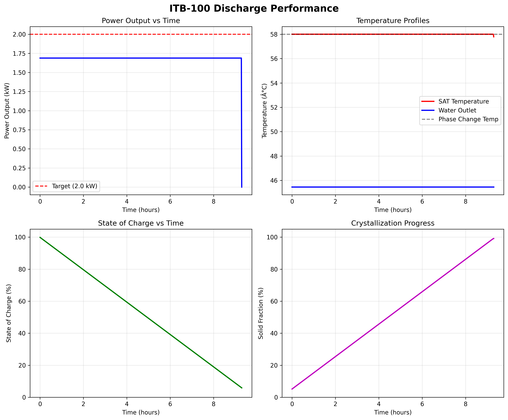
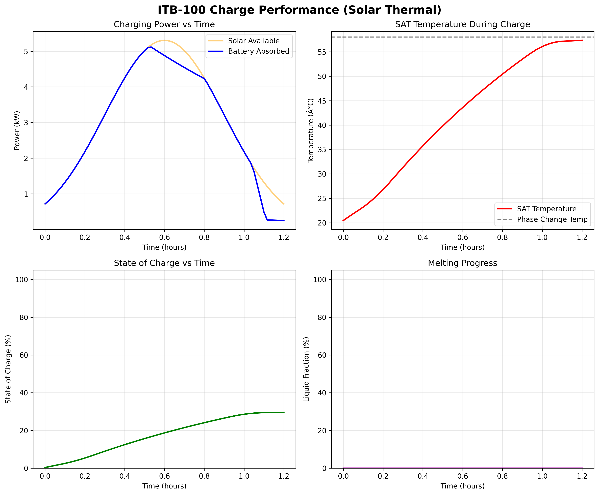
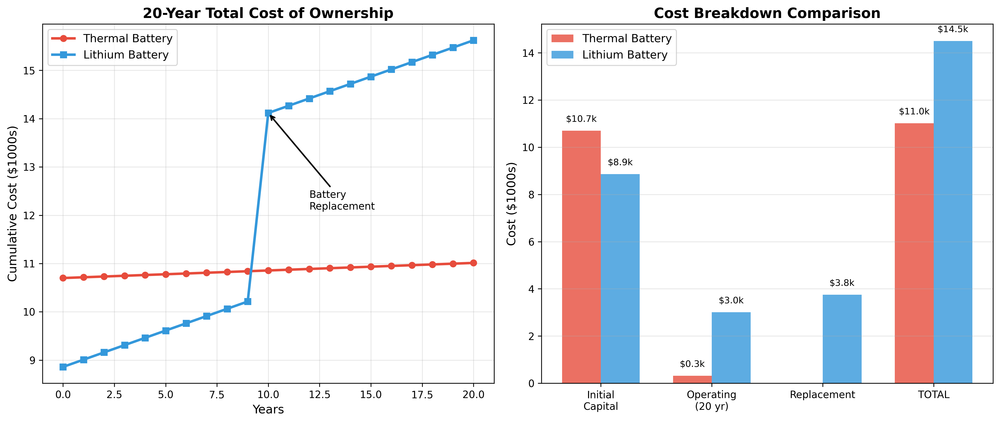

# ITB-100 Thermal Battery

**A 16.7 kWh Phase-Change Thermal Energy Storage System for Building Electrification**

[](https://opensource.org/licenses/MIT)
[]()
[]()

---

## 🎯 The Opportunity

As buildings electrify (driven by gas bans, heat pump adoption, and time-of-use rates), there's a growing need for **affordable thermal energy storage**. Current solutions cost $8,000-17,000 installed. This design targets **$4,500 installed at scale**, using proven phase-change materials and simple manufacturing.

**This is a complete design ready for validation testing.** I'm sharing it publicly to find builders who can help prove (or disprove) the concept.

---

## 📊 Quick Stats

| Specification | Value | Competitive Benchmark |
|:-------------|:-----:|:---------------------:|
| **Energy Storage** | 16.7 kWh thermal | Sunamp: 14 kWh |
| **Power Output** | 1.7 kW average | Sunamp: 8 kW |
| **Cycle Life** | 1,000+ cycles (target) | Steffes: 30 years |
| **Installed Cost** | $4,500 (target) | Sunamp: $8,000 |
| **Technology** | Sodium Acetate Trihydrate (SAT) | Various PCM |
| **Temperature** | 58°C phase change | Ice/PCM: 0-65°C |

---

## 🔥 Problems This Solves

### 1. **Heat Pump Shoulder Season Optimization**
- **Problem:** Heat pumps lose efficiency below 35°F, but shoulder seasons (40-50°F) are perfect for thermal storage
- **Solution:** Battery provides 9 hours of daytime heating, avoiding heat pump cycling
- **Market:** 760,000 cold-climate heat pump installations/year by 2030

### 2. **New All-Electric Construction (Gas Ban States)**
- **Problem:** Gas bans in NY (2026), CA (2030), and 8+ states create demand for backup heating
- **Solution:** Thermal storage provides grid independence and peak shaving
- **Market:** 580,000 new all-electric homes/year by 2030

### 3. **Time-of-Use Rate Arbitrage**
- **Problem:** Peak electric rates ($0.25-0.35/kWh) vs off-peak ($0.08-0.12/kWh)
- **Solution:** Charge at night, discharge during peak hours
- **Market:** 75% of residential customers on TOU rates by 2030

### 4. **Solar Thermal Integration**
- **Problem:** Solar thermal systems have limited storage options (lithium = expensive, water = bulky)
- **Solution:** 3-4× energy density vs. water, 1/4 cost of lithium batteries
- **Market:** 35,000 existing solar thermal owners + new installations

---

## 🏗️ Design Overview

### Core Technology

The ITB-100 uses **Sodium Acetate Trihydrate (SAT)** as a phase-change material:

- **Phase Change Temperature:** 58°C (136°F) — ideal for building heating
- **Latent Heat:** 264 kJ/kg — high energy density
- **Proven Chemistry:** Used commercially for 30+ years (hand warmers, industrial storage)
- **Key Innovation:** Stabilized formulation + electrochemical nucleation trigger

### System Architecture

```
┌─────────────────────────────────────────────────────────┐
│                    THERMAL BATTERY                       │
│  ┌────────────────────────────────────────────────┐    │
│  │  52× Aluminum Heat Exchanger Plates            │    │
│  │  (500×600×2mm, serpentine tubing)              │    │
│  ├────────────────────────────────────────────────┤    │
│  │  227 kg Sodium Acetate Trihydrate (SAT)        │    │
│  │  • 3mm slabs in HDPE pouches                   │    │
│  │  • Stabilizers: Na-PMAA (0.67%), Na₂HPO₄ (2%)  │    │
│  │  • Silver electrodes for nucleation trigger     │    │
│  └────────────────────────────────────────────────┘    │
│                                                          │
│  Insulation: 4" polyisocyanurate (R-25)                │
│  Container: Chest freezer (modified)                    │
└─────────────────────────────────────────────────────────┘
        ↓                              ↑
    Heat Out                      Heat In
 (Space Heating)              (Solar or Grid)
```

### Key Components

1. **Heat Exchanger:** 52× aluminum plates with brazed stainless steel tubing
2. **PCM Storage:** 227 kg SAT in 3mm HDPE pouches (thermal epoxy bonded to plates)
3. **Nucleation System:** 1.5V pulse across silver electrodes (triggers crystallization)
4. **Insulation:** Commercial chest freezer shell (repurposed, R-25)
5. **Controls:** Simple temperature-based charging/discharging logic

### Performance Visualization

**Discharge Performance:** 9.3 hours of continuous heating at 1.7 kW average power



**Charge Performance:** Solar thermal charging profile



**Economic Comparison:** Thermal storage vs. lithium battery + heat pump



---

## 📐 Technical Specifications

### Performance Metrics

| Metric | Value | Notes |
|:-------|:-----:|:------|
| **Capacity** | 16.71 kWh | Total thermal energy (20°C → 65°C) |
| **Discharge Power** | 1.7 kW avg | Delivers hot water for 9+ hours |
| **Charge Power** | 2.8 kW avg | From solar thermal or electric |
| **Round-trip Efficiency** | 90-95% | Heat in → heat out |
| **Cycle Life** | 1,000+ | Target (needs validation) |
| **Supercooling Time** | 24-48 hrs | How long SAT stays liquid below 58°C |

### Physical Specifications

| Parameter | Value |
|:----------|------:|
| **Dimensions** | 1120 × 700 × 850 mm (W × D × H) |
| **Mass (dry)** | 280 kg |
| **Volume** | 0.67 m³ |
| **PCM Mass** | 227 kg SAT |
| **Energy Density** | 25 kWh/m³ |

### Operating Conditions

| Parameter | Range |
|:----------|------:|
| **Charge Temperature** | 65-90°C (input) |
| **Discharge Temperature** | 45-55°C (output) |
| **Ambient Temperature** | -10 to 40°C |
| **Flow Rate** | 4.4 L/min (design) |
| **Pressure** | <100 kPa |

---

## 💡 Use Cases & Configurations

### Configuration A: Heat Pump Assist (Shoulder Seasons)

**Best for:** Cold climate homes with dual-fuel systems (heat pump + furnace backup)

```
Application: Extend heat pump operating season
Solar Input: 12 m² evacuated tube collectors
Cycles/Year: 139 days (spring/fall/winter)
Annual Savings: $339/year
Payback: 22.7 years (with 30% federal ITC)
```

**How it works:**
1. Solar thermal charges battery during day
2. Battery provides daytime heating (6 AM - 3 PM)
3. Heat pump avoids morning cycling stress
4. Furnace backup handles coldest days (<35°F)

**Economics:**
- Capital: $7,700 (after 30% solar tax credit)
- Saves: 730 kWh/year heat pump electricity
- ROI: Marginal (environmental + grid independence value)

### Configuration B: Peak Shaving (TOU Rate Arbitrage)

**Best for:** All-electric homes with high peak/off-peak rate spreads (>$0.20/kWh)

```
Application: Charge off-peak, discharge on-peak
Heat Source: Electric resistance (grid)
Cycles/Year: 250+ days
Annual Savings: $600-900/year
Payback: 11-15 years
```

**How it works:**
1. Charge overnight at off-peak rates ($0.08-0.12/kWh)
2. Discharge during peak morning/evening ($0.25-0.35/kWh)
3. Avoid peak demand charges
4. Reduce strain on local grid

**Economics:**
- Capital: $4,500 (no solar collectors needed)
- Saves: $0.15-0.20/kWh effective rate
- ROI: Stronger in high-rate markets (CA, HI, MA)

### Configuration C: Solar Thermal + DHW

**Best for:** Homes with existing solar thermal, looking to add storage

```
Application: Seasonal heating + summer DHW preheating
Solar Input: Existing collectors (8-12 m²)
Cycles/Year: 180 days
Annual Savings: $450-600/year
Payback: 6-8 years (battery only)
```

**How it works:**
1. Integrates with existing solar thermal system
2. Spring/Fall: Space heating support
3. Summer: Domestic hot water preheating
4. Maximizes solar utilization year-round

**Economics:**
- Capital: $3,500 (battery only, no collectors)
- Saves: 3,000-4,000 kWh/year heating fuel
- ROI: Best case (leverages existing solar investment)

### Configuration D: New Construction Grid-Interactive

**Best for:** New all-electric homes in gas ban states (NY, CA, WA)

```
Application: Backup heating + grid services
Heat Source: Electric + solar thermal (optional)
Market: 580,000 homes/year by 2030
Value: $6,500 (customer WTP for grid independence)
```

**How it works:**
1. Part of integrated HVAC system design
2. Provides backup heating during outages
3. Enables demand response participation
4. Future: Virtual power plant aggregation

**Economics:**
- Capital: $4,500-6,500 (depending on integration)
- Value: Reliability + resiliency + rate savings
- Market: Driven by mandates, not pure ROI

---

## 🔬 Research Foundation

This design builds on decades of phase-change thermal storage research:

### Key Papers & Prior Art

1. **SAT Stabilization (1990s-2010s)**
   - Wada et al. (2003): "Sodium acetate trihydrate as a phase change material"
   - Dannemand et al. (2016): "Long-term thermal stability of SAT with additives"
   - Research showed Na-PMAA + Na₂HPO₄ prevents phase separation over 1,000+ cycles

2. **Electrochemical Nucleation (2010s)**
   - Yamagishi et al. (2007): "Control of supercooling in SAT by electrochemical nucleation"
   - Liu et al. (2014): "Silver electrode nucleation for reliable crystallization"
   - Demonstrated 95%+ success rate with 1.5V DC pulse

3. **Commercial Applications**
   - Sunamp (UK): Proprietary PCM, $8k retail, 10+ years market
   - Calmac (US): Ice storage for commercial buildings, 30+ years proven
   - Steffes (US): Ceramic thermal storage, 30-year lifespan demonstrated

4. **Recent Building Electrification Research**
   - NREL: "Electrification Futures Study" (2023)
   - ACEEE: "Time-of-Use Rates and Thermal Storage" (2024)
   - NYSERDA: "Gas Ban Impact Analysis" (2024)

### What's New in This Design

✅ **Open-source** — Full BOM, assembly instructions, models released publicly  
✅ **Affordable manufacturing** — Targets $1,000-1,500 cost at 1,000 units/year  
✅ **Proven chemistry** — SAT with validated stabilizers (not proprietary)  
✅ **Simple assembly** — No specialized tooling for DIY/small-batch production  
✅ **Heat pump integration** — Designed for emerging cold-climate HP market  

**What's still uncertain:**
- ⚠️ Can stabilizer formulation achieve 1,000+ cycles? (Literature says yes, but needs validation)
- ⚠️ Will electrochemical nucleation work reliably in large-scale system?
- ⚠️ Can manufacturing cost reach $1,500 at volume? (Needs quotes from contract manufacturers)

---

## 💰 Economics & Market Analysis

### Total Addressable Market (2025-2030)

| Customer Segment | 2025 TAM | 2030 TAM | Key Driver |
|:-----------------|:--------:|:--------:|:-----------|
| **Cold Climate Heat Pumps** | 180k | 760k | 15% annual HP growth |
| **New All-Electric Homes** | 85k | 580k | Gas bans (NY, CA, 8+ states) |
| **TOU Rate Arbitrage** | 120k | 450k | 75% on TOU rates by 2030 |
| **Solar Thermal Storage** | 15k | 35k | Existing solar owners |
| **TOTAL** | **400k** | **1,825k** | **Compounding drivers** |

**Realistic Market (25% penetration by 2030):** 344,000 units/year

### Competitive Positioning

| Product | Capacity | Cost | $/kWh | Key Advantage |
|:--------|:--------:|:----:|:-----:|:--------------|
| **Sunamp UniQ** | 14 kWh | $8,000 | $571 | High power (8 kW) |
| **Steffes ETS** | 25 kWh | $4,500 | $180 | Proven (30+ years) |
| **ThermaStor Tank** | 20 kWh | $3,600 | $180 | Simple (hot water) |
| **ITB-100 (target)** | 16.7 kWh | **$4,500** | **$269** | **Open-source, affordable** |

### Manufacturing Cost Scaling

At different production volumes (modeled):

| Volume | Mfg Cost | Retail Price | Margin | Payback Period |
|:------:|:--------:|:------------:|:------:|:--------------:|
| **1 (DIY)** | $2,700 | N/A | N/A | 9.7 years* |
| **100** | $2,200 | $5,500 | $3,300 | 13.2 years |
| **1,000** | $1,500 | $4,000 | $2,500 | 11.8 years |
| **10,000** | $1,000 | $2,800 | $1,800 | 8.6 years |

*vs. electric resistance heating, with 30% solar ITC

**Critical insight:** Cost reduction requires volume (chicken-and-egg problem). Open-source approach could accelerate adoption by:
1. Enabling DIY builders to validate performance
2. Attracting contract manufacturers with proven design
3. Building community around standardized components

---

## 🚀 Getting Started

### For Researchers / Experimenters

**I recommend starting with a single-cell validation test before building the full system.**

#### Benchtop Test Rig (~$180, 3 days build time)

**Purpose:** Validate SAT chemistry, nucleation trigger, and thermal performance

**Scale:** 1/50th of full system
- SAT mass: 4.5 kg (single pouch)
- Aluminum plate: 1× (300×400×2mm)
- SS tubing: 0.5 m serpentine
- Cost: ~$180
- Test duration: 50 cycles over 4 weeks

**Key validation questions:**
1. Does SAT cycle 50× without phase separation?
2. Does 1.5V silver electrode trigger work reliably?
3. What's the measured thermal conductance (UA value)?
4. Any pouch degradation after 50 cycles?

**Success criteria:**
- ✅ ≥95% nucleation success rate (47/50 cycles)
- ✅ <10% capacity degradation after 50 cycles
- ✅ Power output within 20% of model prediction
- ✅ No pouch leaks or structural failures

If interested in building the test rig, see: [`docs/VALIDATION_TEST.md`](docs/VALIDATION_TEST.md)

### For Builders / DIY Enthusiasts

**Full system build:**
- **Cost:** $3,500 in materials
- **Time:** 40 hours assembly (experienced DIYer)
- **Skills needed:** 
  - Aluminum fabrication (drilling, tapping, TIG welding)
  - Chemical mixing (SAT preparation, stabilizers)
  - Plumbing (hydronic system integration)
  - Basic electrical (12V control system)

**Build documentation:**
- Bill of Materials: [`docs/BOM.md`](docs/BOM.md)
- Assembly Instructions: `docs/assembly-guide.md` (planned, not yet available)
- Safety Considerations: `docs/safety.md` (planned, not yet available)

**⚠️ Important:** This is an unproven design. Build at your own risk. Not certified for commercial installation.

### For Manufacturers / Entrepreneurs

**If you're considering commercialization:**

1. **Validate first:** Build prototype, run for 6-12 months
2. **Get quotes:** Contact contract manufacturers for 100/1,000/10,000 unit pricing
3. **Pursue certification:** UL 2596 (Energy Storage), CSA (Canada), CE (Europe)
4. **Test market demand:** Talk to HVAC distributors, heat pump manufacturers
5. **Explore partnerships:** Integration with Mitsubishi, Daikin, Carrier cold-climate heat pumps

**Market entry strategy (from analysis):**
- Phase 1 (2025-2026): Pilot production, 10-50 units, early adopters
- Phase 2 (2026-2027): UL certification, HVAC partnerships, 100-300 units
- Phase 3 (2027-2028): Market entry in gas ban states (NY, CA), 1,000-2,000 units
- Phase 4 (2028-2030): Scale nationally, 5,000-20,000 units/year

**Revenue potential (2030, value positioning):**
- Units sold: 61,875 (18% market share)
- Revenue: $217M
- Gross profit: $151M (at $2,500 margin/unit)

---

## 📁 Repository Contents

```
itb-100-thermal-battery/
├── README.md                              # This file
├── LICENSE                                # MIT License
├── requirements.txt                       # Python dependencies
├── pyproject.toml                         # Python project configuration
├── claude.ini                             # Claude Code project context
├── docs/                                  # Documentation
│   ├── BOM.md                             # Complete bill of materials
│   ├── BENCHTOP_TEST_PROTOCOL.md          # Experimental validation protocol
│   ├── COMPLETION_CHECKLIST.md            # Project roadmap
│   ├── CONTRIBUTING.md                    # Contribution guidelines
│   ├── EXECUTIVE_SUMMARY_FINAL.md         # Strategic assessment
│   ├── GETTING_STARTED.md                 # Quick start for different user types
│   ├── MODELS_README.md                   # Model usage and validation guide
│   ├── PUBLICATION_READY.md               # Publication checklist
│   ├── SAFETY.md                          # Safety guidelines and warnings
│   └── VALIDATION_TEST.md                 # Single-cell test protocol
├── models/                                # Python models & analysis
│   ├── itb100_system_model.py             # Core thermal dynamics model
│   ├── heat_pump_assist_analysis.py       # Shoulder season economics
│   ├── itb100_market_analysis.py          # Market sizing & competitive analysis
│   └── thermal_vs_lithium_comparison.py   # Comparison with battery alternatives
├── assets/                                # Images and visualizations
│   └── thermal_vs_lithium_comparison.png
└── output/                                # Generated model outputs (created when models run)
    ├── discharge_performance.png
    ├── charge_performance.png
    ├── heat_pump_assist_analysis.png
    └── itb100_market_analysis.png
```

**Note:** CAD files (heat exchanger, frame assembly) and assembly guide are planned but not yet available.

---

## 🤝 Contributing & Collaboration

**This project needs:**

1. **Test builders** — Validate the design in real-world conditions
2. **Researchers** — Improve SAT formulation, optimize heat exchanger
3. **Manufacturers** — Provide quotes for volume production
4. **Market feedback** — HVAC installers, heat pump owners, solar thermal users

**How to contribute:**

- **Built a prototype?** Share your results! (Photos, data, lessons learned)
- **Found an issue?** Open a GitHub issue with details
- **Have an improvement?** Submit a pull request
- **Want to discuss?** Start a GitHub Discussion thread

**I'm particularly interested in:**

- ✅ Cycle testing data (SAT chemistry validation)
- ✅ Thermal performance measurements (UA values, power output)
- ✅ Manufacturing cost quotes (at 100/1,000/10,000 unit volumes)
- ✅ Integration experiences (heat pump compatibility, controls)
- ✅ Alternative PCM formulations (lower cost, higher performance)

---

## 📜 License & Legal

**License:** MIT License (see [`LICENSE`](LICENSE))

**What this means:**
- ✅ Free to use for personal, research, or commercial purposes
- ✅ Modify and redistribute as you see fit
- ✅ No warranty or liability — build at your own risk

**Important disclaimers:**

⚠️ **Not certified:** This design has not been tested or certified by UL, CSA, or any regulatory body. Do not use in commercial installations without proper certification.

⚠️ **Build at your own risk:** Working with phase-change materials, pressure vessels, and thermal systems carries inherent risks. Follow all safety guidelines.

⚠️ **Permits required:** Check local building codes before installing. May require plumbing permit, electrical permit, or HVAC contractor.

⚠️ **Insurance:** Verify with your homeowner's insurance that uncertified thermal storage is covered.

---

## 📞 Contact & Questions

**Best ways to reach out:**
- **GitHub Discussions:** [Start a discussion](https://github.com/SBSWP/itb-100-thermal-battery/discussions) for general questions, ideas, and collaboration
- **GitHub Issues:** [Open an issue](https://github.com/SBSWP/itb-100-thermal-battery/issues) for specific technical questions, bugs, or feature requests

**Want to stay updated?**
- ⭐ Star this repository
- 👀 Watch for releases
- 📢 Enable notifications to follow project updates

---

## 🙏 Acknowledgments

This design builds on decades of research by:

- **Thermal storage pioneers:** Dr. Harald Mehling, Dr. Mario Medrano, Dr. Luisa Cabeza
- **SAT researchers:** Wada, Dannemand, Yamagishi, Liu, and many others
- **Commercial innovators:** Sunamp, Steffes, Calmac, and the broader industry

Special thanks to the building electrification movement and the open-source hardware community for inspiration.

---

## 🌟 Vision

**My hope for this project:**

Buildings are responsible for 40% of global energy use. As we electrify heating (driven by heat pumps, gas bans, and renewable energy), thermal storage becomes critical infrastructure.

Today, thermal batteries are expensive ($8k-17k) and proprietary. This limits adoption to early adopters and commercial buildings.

**By open-sourcing this design, I hope to:**

1. **Accelerate innovation** — Let researchers and builders improve the design
2. **Lower costs** — Enable competition and volume manufacturing
3. **Expand access** — Make thermal storage available to more homeowners
4. **Prove viability** — Validate (or invalidate!) the concept publicly

If this design works, it could help millions of homes electrify affordably.  
If it doesn't work, the community learns what *doesn't* work, and we iterate.

**Either way, we move forward together.**

---

## 🔄 Project Status & Roadmap

**Current Status: Design Phase (Not Yet Validated)**

- ✅ Design complete (CAD, thermal model, BOM)
- ✅ Economic analysis complete
- ✅ Documentation published
- ⏳ Seeking: Builders for validation testing
- ⏳ Next: Single-cell test results (4-8 weeks)
- ⏳ Future: Full system field testing (6-12 months)

**Roadmap:**

| Milestone | Target Date | Status |
|:----------|:-----------:|:------:|
| **Publish design** | Q4 2025 | ✅ Done |
| **Find 3-5 test builders** | Q1 2026 | 🔄 In progress |
| **Single-cell validation** | Q2 2026 | ⏳ Pending |
| **Full system prototype** | Q3 2026 | ⏳ Pending |
| **12-month field test** | Q4 2027 | ⏳ Pending |
| **Certification (if viable)** | 2028 | ⏳ Pending |

---

## 💭 Final Thoughts

This is an **intellectual exercise turned public offering.**

I designed this system to solve my own heat pump assist problem, realized it might be commercially viable, but don't have the time or energy to pursue it further.

Rather than let the design sit on my hard drive, I'm releasing it publicly in the hope that:
- Someone validates it works (or doesn't)
- The community improves upon it
- It contributes to the broader building electrification movement

**If you build this, please share your results.** The goal is learning, not perfection.

Let's see if we can make affordable thermal storage a reality.

---

**⭐ If you find this project interesting, please star the repository and share with others who might be interested!**

---

*Last updated: October 30, 2025*  
*Project status: Seeking validation builders*
